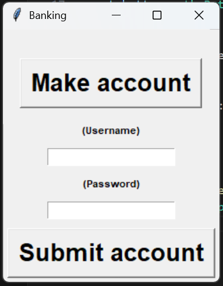

# 💰 Fake Banking System (Tkinter)

A simple Python GUI application that simulates basic banking account features like account creation, login, and deletion. Built using **Tkinter** with local JSON storage.
Right now, the app version is 1.0.0!

---

## 🚀 Features

* 🧾 Create accounts (username + password)
* 🔐 Secure password hashing (SHA-256)
* 🔑 Login system
* ❌ Delete accounts
* 💾 Stores data locally in a JSON file

---

## 🖥️ Demo
## This is V1, the current version!



## 📦 Installation

1. Clone the repository:

```bash
git clone https://github.com/MRKVRYouTube/MainBanker
cd fake-banking-system
```

2. Run the program:

```bash
python main.py
```

---

## 🛠️ Requirements

* Python 3.10+
* No external libraries required (uses built-in modules)

---

## 📁 File Structure

```
📦 fake-banking-system
 ┣ 📜 main.py
 ┣ 📜 user_data.json
 ┗ 📜 README.md
```

---

## ⚠️ Disclaimer

This project is for **educational purposes only**.
It is not yet a real banking system. You should not store credentials, but it can be used. (It is stored as SHA-256 encoded. Please consult with me if you have issues!)

---

## 💡 Future Improvements

* [x] Switch to CustomTkinter UI
* [x] Add account dashboard
* [x] Improve UI/UX design
* [x] Add user sessions
* [ ] Make in .exe or .app so you DON'T have to install python

---

## 🤝 Contributing

Pull requests are welcome. For major changes, open an issue first.

---

## 📄 License

This project is open-source and available under the MIT License.
